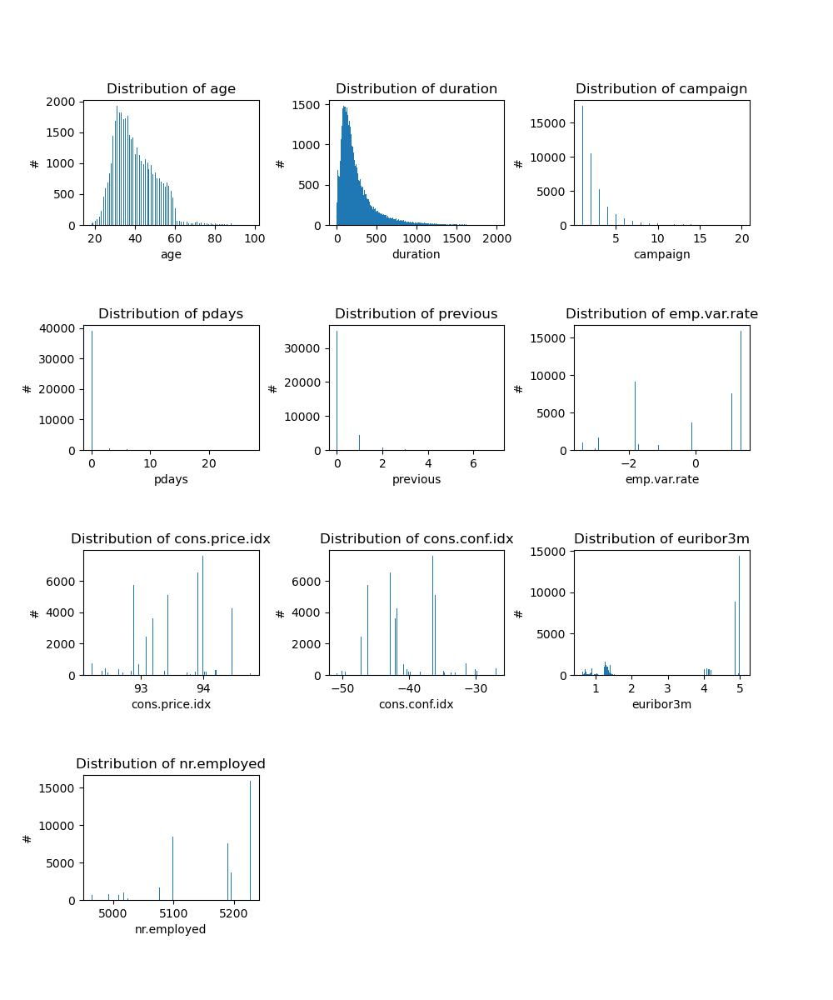
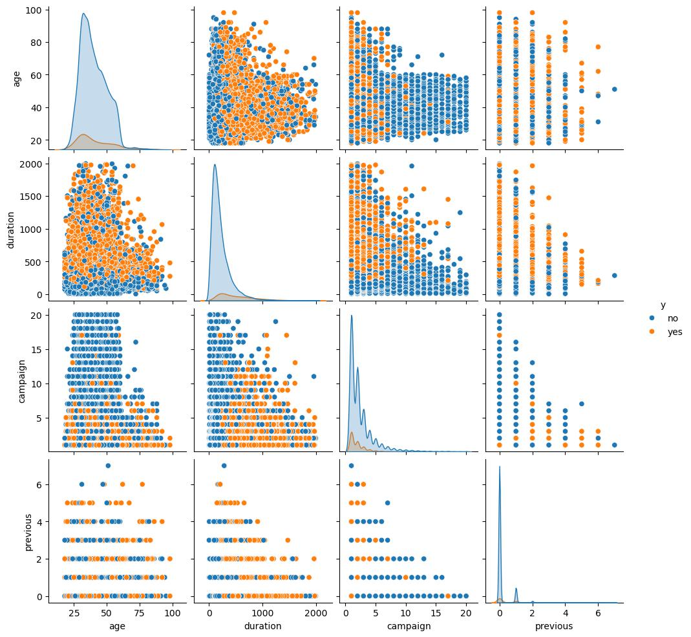
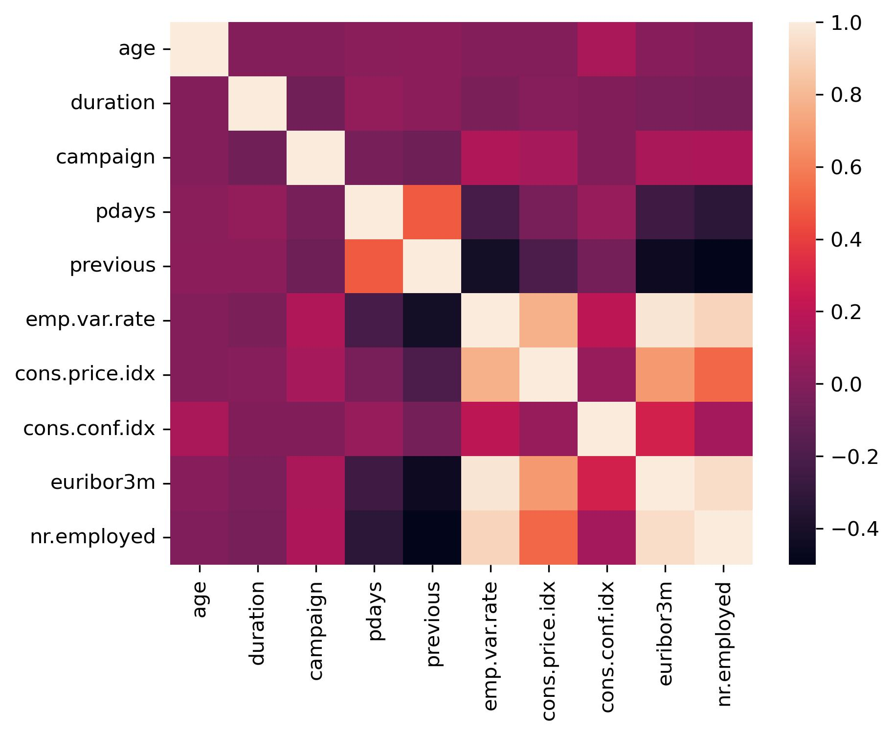

# Classifier Comparison and Recommendation to Sales Team Regarding Targeted Marketing for Term Savings

### Problem Statement

Ultimately, we would like to help our client, a bank , increase the number of term deposits (i.e. CDs) that they are able to sell to customers for each hour of time that their employees spend trying to sell these term deposits.

A dataset from the UC Irvine Machine Learning Repository was provided.  This dataset contained term deposit sales information from a bank in Portugal.  We examined this dataset to get an understanding of what data was available and what features correlate to a successful sales outcome. 

KNN, LogisticRegression, DecisionTree, and SVC Models were constructed and fit.  Retained test data was used to evaluate these models' prediction accuracy.  Similarly, the models' training accuracy was computed.  The training time for each model was recorded when the training data was fit. 

### Data Cleaning

The dataset contained 20 features and one output classification.  The features were comprised of 5 integer variables, 5 float variables, and 10 categorical variables.

None of the input data appeared to be missing.  However, some of the categorical data contained 'unknown' values.

The following are the integer features:
age, duration, campaign, pdays, and previous 

The following are the continuous numerical (float) values:
emp.var.rate, cons.price.idx, cons.conf.idx, euribor3m, and nr.employed

The following are the categorical values:
Job, marital, education, default, housing, loan, contact, month, day_of_week, and poutcome 

The job and marital features contained 'unknown' values.  However, there were only a small number of these.  Thus, we dropped these rows.

The default column only had 3 defaults, so this column was dropped.

#### EDA

##### Univariate Analysis

First, we looked at the distribution of all numerical values.  The histograms below show these distributions.  As one can see, the distributions for age, duration, and campaign are the only ones that look continuous.  However, one might argue that pdays and previous distributions could be as well despite their lack of data spread.

#### Bivariate Analysis

Pairplots were generated for the distributions that looked somewhat continuous, i.e. age, duration, campaign, and previous as is shown in the figure below.  These plots were colored by the output classification, 'y', which represented the choice to either open or not open a term account.

All of the pair plots between age, duration, and campaign show clear regions of separability between those who opened term accounts and those who did not.  The plot between previous and campaign show some potential for separating the output classification.

A heatmap was generated showing the correlation of all of the numeric values, which is shown below.  This shows a high correlation rate among the employment variability rate, the euribor3m, and the number of unemployed.  For the first run of modeling, he euribor3m was kept and the other 2 features were dropped.  Later, the PCA was used to combine these 3 variables, thereby reducing the dimensionality of the data. However, re-running the models did not show significant changes in model test accuracy.

#### Analysis of Categorical Features

The categorical data was analyzed to see how the term deposit offer acceptance varied with each categorical value.  

The single marital status has only 3% higher deposit rate than those who are either married or divorced.  This could be within the margin of error. Thus, the marital column was dropped.

It should also be noted that the acceptance rate does not vary based upon having a personal loan, having a housing loan, or based upon the day of the week.  Therefore, these columns were also dropped from our initial analysis.

#### Data Preparation

As previously mentioned, rows with unknown values were dropped.  The unknown, marital, housing, loan, and day_of_week columns were also dropped.

The reference paper stated that the ages of respondents should be greater than or equal to 18.  Thus, rows with ages less than 18 were dropped.

To eliminate outliers, we dropped durations above 2000 and campaigns above 20.

We noticed that a special value, 999, was used to indicate the condition where customers were not previously contacted.  Therefore, this special value was replaced with 0 and a new Boolean column was generated to indicate if the customer had been previously contacted.

It should be noted that the histograms above were generated after these data preparation changes were made.

### Modeling

An 80/20 train/test split was made for the purpose of training and evaluating all models.

#### Baseline Model

A baseline model was fit and showed an accuracy of 88.7%.

#### Simple Logistic Regression Model

GridSeearchCV was used to select the best of 3 C parameters (0.1, 1, and 10).  This resulted in a training accuracy of 91.1% and a test accuracy of 91.1%.

#### Comparison of KNN, LogisticRegression, DecisionTree, and SVC models.

The KNN, LogisticRegression, DecisionTree, and SVC models were fit, timed, and tested with GridSearchCV.  All four models resulted in roughly the same test accuracy, ~91%.  However, the training time was slightly longer for the KNN Classifier and much longer for the SVC.

Model                Train Time  Train Accuracy  Test Accuracy
DecisionTree	      0.238136      0.915912       0.912620
SVC                  31.204459      0.921150       0.911511
LogisticRegression    0.218276      0.910674       0.910648
KNN                   1.222344      0.926357       0.904609

It should be noted that GridSearchCV found the following to be the best hyperparameters for each model:

Model                  HyperParm
KNN                    {'knn__n_neighbors': 7}
LogisticRegression     {'logisticregression__C': 1}
DecisionTree		   {'decisiontreeclassifier__max_depth': 5}
SVC       			   {'svc__C': 1, 'svc__kernel': 'rbf'}

The LogisticRegression and DecisionTree models also have the benefit of ranking the importance of the features.

### Further Feature Modifications and Remodeling

PCA was used to combine the employment variability rate, # employed, and the euribor3m features into one feature.

Because the housemaid, services, admin., technician, management, self-employed, and entrepreneur job types have similar acceptance rates, e.g. 8 - 12%, these were combined into a single other category.  This limited the job categorical values to other (~10%), blue-collar (6%), retired (25%), unemployed (14%), and student (31%).

The education feature was dropped as it did not seem to matter much.

Neighboring months with similar acceptance rates were combined:  Winter (Dec - Mar), Mid Spring (April), Summer (May - Aug), Early Autumn (Sept - Oct), and Late Autumn (Nov).  This could prove useful as there was no data for January and February.  This assumes that the response rate for January and February looks like December and March.

The aforementioned models were rerun with the following results:

Model                    Train Time  Train Accuracy  Test Accuracy
DecisionTree		      0.214596      0.917576        0.912867
LogisticRegression        0.245056      0.910365        0.910402
SVC                      72.214609      0.928576        0.910402
KNN                       0.968201      0.927128        0.904363

It can be seen that Logistic Regression and SVC switched their ranking regarding test accuracy.  However, they all have essentially the same test accuracy.  The SVC accuracy fell by 0.1%.  We have no explanation why the fitting time seems to have taken twice as long for SVC.  However, the fitting time for the DecisionTree and LogisticRegression models seems to have both improved by about 30 ms.

### Results

### Feature Selection
#### Decision Tree Classifier
The Decision Tree Classifier indicates that the duration and employed features are the most important.

The consumer confidence index, poutcome_sucess, early autumn season, and consumer price index are the next most important features.
It also lists the campaign and pdays have some minor impact.

On the second run, the priority of the confidence index and poutcome_sucess features switched.  However, the winter season now became more important than early autumn.

#### Logistic Regression
The Logistic Regression model had a different ranking of the importance of features than the Decision Tree Classifier.  However, these did not change with the feature changes that we made for the second run.

The prevously contacted, duration, employed, and winter season features were the most important.
The blue collared job, contact_telephone, poutcome_failure, late autumn season, summer season, and early autumn season were the next most important.

#### Comparison of Feature Selection
The DecisionTree made use of fewer features and imparted a different importance to the many features.  However, some (but not all) of the most important features appeared in both models.

### Next Steps
We could remove those features that none of the models found to be important.  For SVC and KNN, we could remove these columns from the data and rerun the fitting and testing.  If the test accuracy did not change for these models, we could leave these columns out.  By testing each column one at a time, we could identify which columns had little to no impact.

We would recommend to the customer to focus their marketing efforts to those who impacted any of the models.  It is likely that these models vary due to the unbalanced nature of the data.  Collecting more data might help.  By doing so, we would hope to collect for data for those feature values that were under-represented.

By marketing to those that meet our current feature ranking, we would hope to collect more data for those feature values that are under-represented but important.  With enough data for each feature value, we could preferentially select data so that each value for one feature is balanced.  Then we could rerun our models to see the importance of these feature values.

